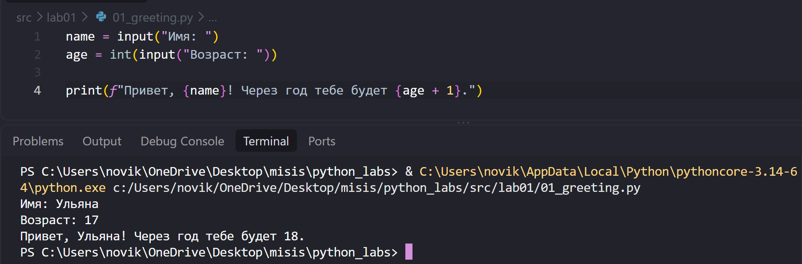
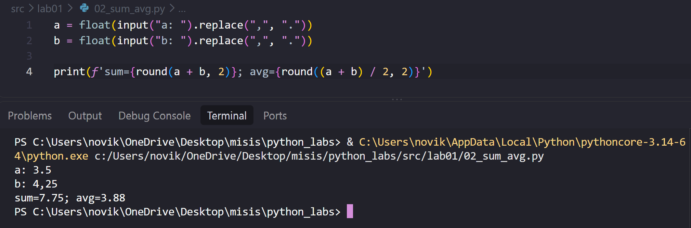
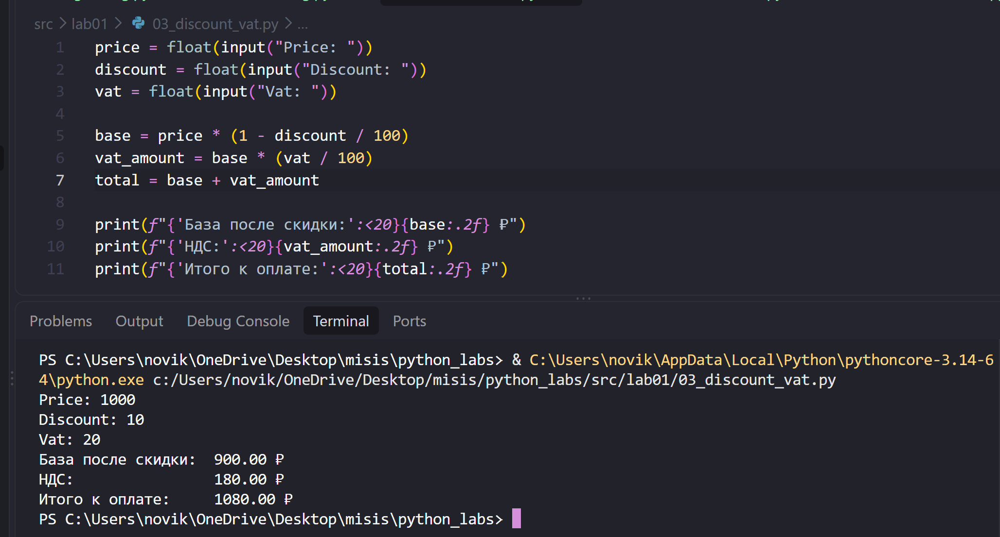
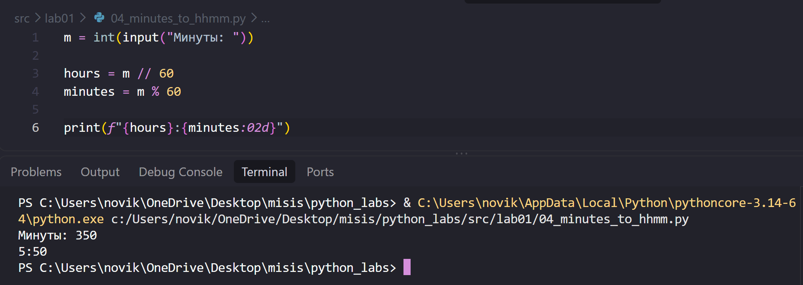
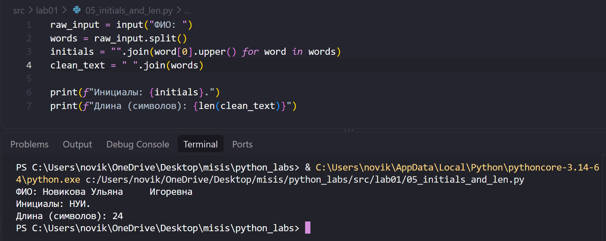

# ЛР1 — Ввод/вывод и форматирование

## Задание 1 - Привет и возраст
Программа считывает имя и возраст, преобразует возраст в целое число и выводит приветственное сообщение с возрастом через год.

## Задание 2 - Сумма и среднее
Считывает два вещественных числа (с поддержкой точки и запятой), рассчитывает их сумму и среднее значение, после чего выводит результат с 2 знаками после запятой.

## Задание 3 - Чек: скидка и НДС
Рассчитывает стоимость со скидкой, НДС и итоговую сумму к оплате. Результат выводится в виде чека с округлением до 2 знаков после запятой.

## Задание 4 - Минуты -> ЧЧ:ММ
Преобразует общее количество минут в часы и остаток минут. Форматирует вывод так, чтобы минуты всегда содержали ровно две цифры (с ведущим нулем).

## Задание 5 - Инициалы и длина строки
Разбивает строку ФИО на отдельные слова, автоматически удаляя лишние пробелы. Извлекает первые буквы в верхнем регистре и считает длину очищенной строки.

