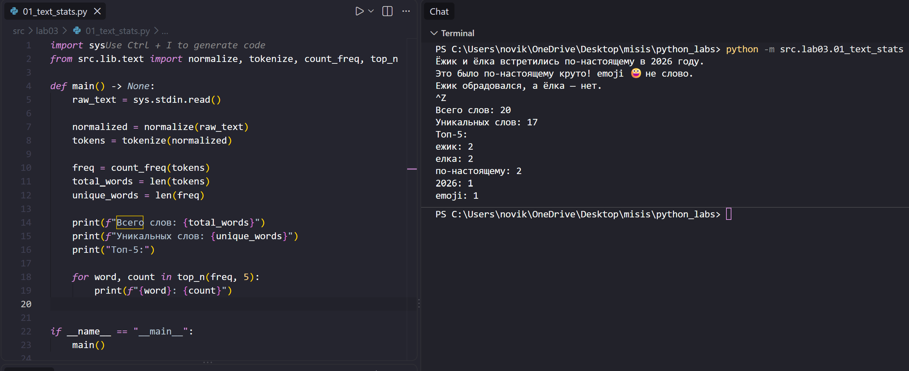

# ЛР3 — Тексты и частоты слов (словарь/множество)

## Задание A - Модуль текста (text.py)
Реализует чистые функции для работы с текстом: нормализацию строки с приведением к casefold и заменой «ё» на «е» (`normalize`), разбиение текста на слова по регулярному выражению с поддержкой дефиса внутри слова (`tokenize`), подсчёт частоты каждого слова (`count_freq`) и получение топ-N самых частых слов с сортировкой по частоте и алфавиту при равенстве (`top_n`). Все функции не выполняют ввод/вывод и покрыты `assert`-проверками внутри файла. Переиспользуемая логика вынесена в `src/lib/text.py`.

## Задание B - Статистика текста (text_stats.py)
Скрипт читает текст из stdin (весь ввод, до EOF), нормализует и токенизирует его с помощью функций из `src/lib/text.py`, считает общее количество слов, количество уникальных слов и выводит топ-5 самых частых слов в формате `слово:количество`. Расположен в `src/lab03/01_text_stats.py`.



---

## Способы запуска `text_stats.py`

Запуск выполняется из **корня репозитория** (там, где лежит папка `src/`), с помощью флага `-m`:

```powershell
python -m src.lab03.01_text_stats
```

### 1. Через `echo` (быстрая проверка одной строкой)

```powershell
echo "Привет, мир! Привет!!!" | python -m src.lab03.01_text_stats
```

### 2. Вручную, с клавиатуры (без `echo`)

```powershell
python -m src.lab03.01_text_stats
```

Терминал «зависает» на пустой строке и ждёт ввода. Можно:
- напечатать текст с клавиатуры и/или вставить его (Ctrl+V);
- нажать **Enter**, чтобы перейти на новую строку (можно ввести несколько строк).

Чтобы завершить ввод (сигнал EOF) и запустить обработку:
- **Windows / PowerShell**: `Ctrl+Z`, затем `Enter`;
- **Linux / macOS**: `Ctrl+D`.