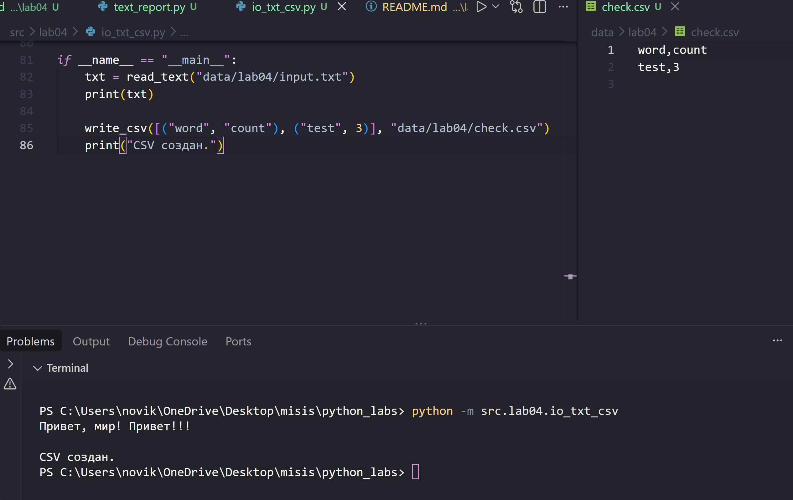
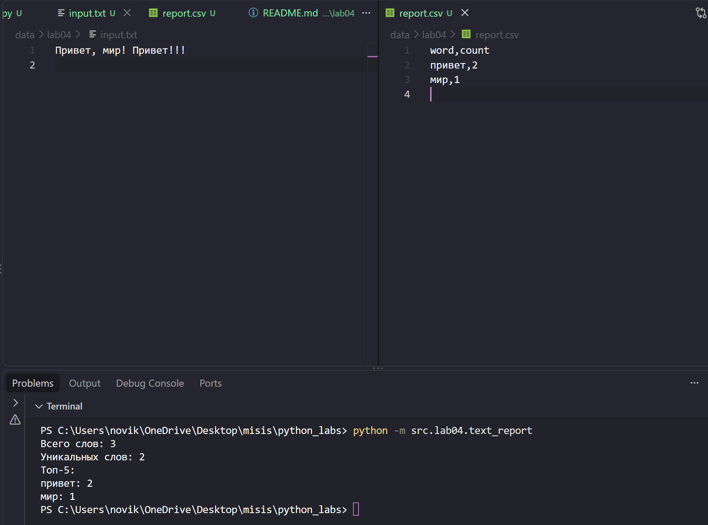

# ЛР4 — Файлы: TXT/CSV и отчёты по текстовой статистике

## Задание A - Модуль ввода/вывода (io_txt_csv.py)
Реализует функции для работы с файлами: чтение текстового файла целиком в указанной кодировке (`read_text`, по умолчанию `utf-8`; если файл не найден или кодировка не подходит - исключение `FileNotFoundError` / `UnicodeDecodeError` «всплывает» наружу без перехвата) и запись списка строк в CSV-файл с разделителем `,` (`write_csv`). Перед записью `write_csv` проверяет, что все строки в `rows` имеют одинаковую длину (и, если задан `header`, что его длина совпадает с длиной строк) - иначе поднимается `ValueError`. Родительская папка для выходного файла создаётся автоматически, если её ещё нет. Расположен в `src/lab04/io_txt_csv.py`.



## Задание B - Отчёт по тексту (text_report.py)
Скрипт читает входной текстовый файл, путь к которому, путь к выходному CSV и кодировка заданы константами `INPUT_PATH`, `OUTPUT_PATH`, `ENCODING` в начале файла (по умолчанию - `data/lab04/input.txt`, `data/lab04/report.csv`, `utf-8`). Текст нормализуется и токенизируется с помощью `src/lib/text.py`, считаются частоты слов, и **полный** отчёт сохраняется в CSV с колонками `word,count`, отсортированными по убыванию частоты и по алфавиту при равенстве. В консоль печатается краткое резюме: общее количество слов, количество уникальных слов и топ-5 самых частых слов (через `top_n` из ЛР3). Если входной файл не найден - скрипт печатает сообщение об ошибке и завершает работу. Расположен в `src/lab04/text_report.py`.



---

## Политика для краевых случаев

- **Пустой входной файл** - `report.csv` будет содержать **только заголовок** `word,count`, строк с данными не будет. В консоль выводится `Всего слов: 0`, `Уникальных слов: 0`, `Топ-5:` без строк после него.
- **Файл не найден** - скрипт не падает, а печатает `Ошибка: файл не найден: <путь>` и завершает работу.
- **Кодировки** - по умолчанию все файлы читаются и пишутся в `UTF-8`. Чтобы прочитать входной файл в другой кодировке, нужно изменить константу `ENCODING` в начале `text_report.py` (например, на `"cp1251"`).
- **Смена входного/выходного файла** - путь к читаемому и записываемому файлу задаётся не флагами командной строки, а константами `INPUT_PATH` и `OUTPUT_PATH` в начале `text_report.py`; чтобы обработать другой файл, нужно изменить эти значения в коде.

---

## Способ запуска `text_report.py`

Запуск выполняется из **корня репозитория** (там, где лежит папка `src/`), с помощью флага `-m`:

```powershell
python -m src.lab04.text_report
```

Скрипт не принимает аргументов командной строки — все настройки (входной файл, выходной файл, кодировка) заданы константами в начале `src/lab04/text_report.py`. Чтобы обработать другой файл или другую кодировку, нужно отредактировать эти константы и запустить скрипт заново той же командой.

---

## Пример

**Вход (`data/lab04/input.txt`):**
```
Привет, мир! Привет!!!
```

**Консоль:**
```
Всего слов: 3
Уникальных слов: 2
Топ-5:
привет: 2
мир: 1
```

**Выход (`data/lab04/report.csv`):**
```
word,count
привет,2
мир,1
```