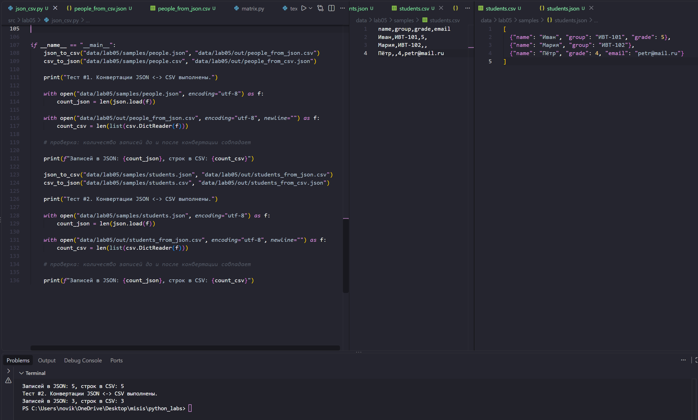
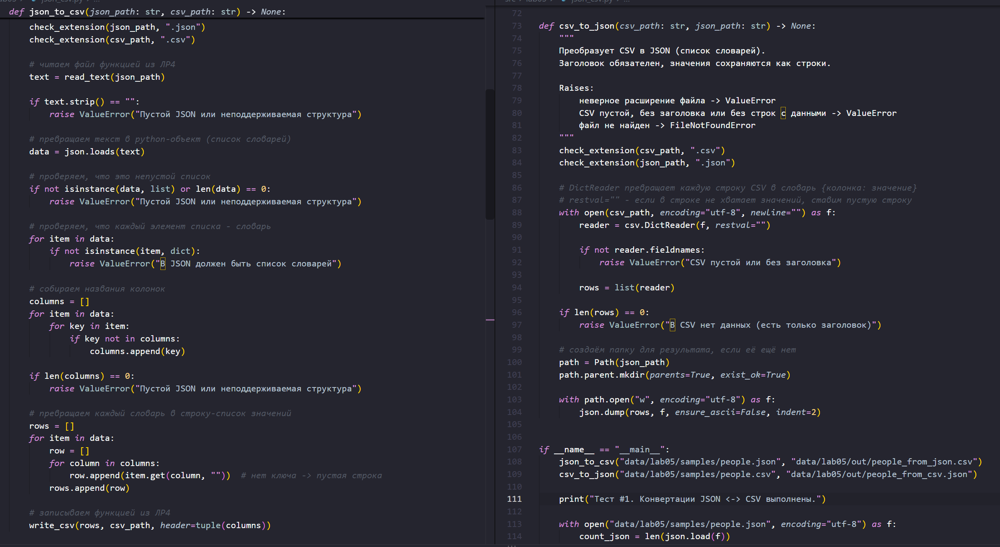
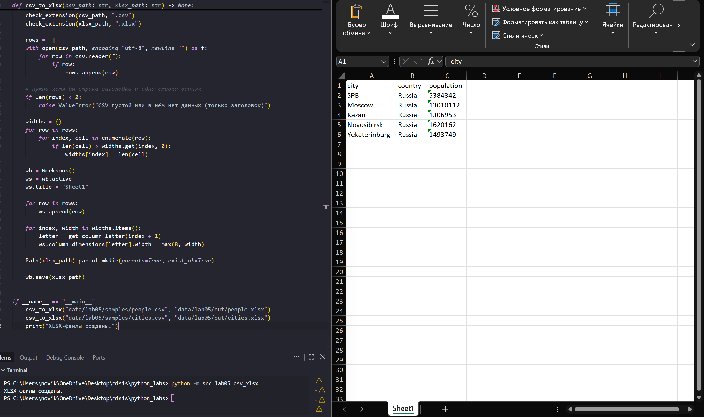

# ЛР5 - JSON и конвертации (JSON <-> CSV, CSV -> XLSX)

## Установка зависимостей
Для задания B нужна одна внешняя библиотека - `openpyxl` (указана в `requirements.txt`). Всё остальное - стандартная библиотека (`json`, `csv`, `pathlib`).

```powershell
pip install -r requirements.txt
```

## Задание A - JSON <-> CSV (json_csv.py)
Модуль содержит две функции конвертации и одну вспомогательную. `json_to_csv(json_path, csv_path)` читает JSON-файл (список словарей) и записывает его в CSV: ключи словарей становятся колонками, каждый словарь - одной строкой. Если у какого-то объекта нет нужного ключа - в ячейку записывается пустая строка. `csv_to_json(csv_path, json_path)` делает обратное: первая строка CSV - заголовок, каждая следующая строка превращается в словарь, результат записывается в JSON через `json.dump(..., ensure_ascii=False, indent=2)`. Вспомогательная `check_extension(path, extension)` проверяет расширение файла и поднимает `ValueError`, если оно неверное. Для чтения JSON и записи CSV используются функции `read_text` и `write_csv` из ЛР4 (`src/lab04/io_txt_csv.py`). Расположен в `src/lab05/json_csv.py`.





## Задание B - CSV -> XLSX (csv_xlsx.py)
Функция `csv_to_xlsx(csv_path, xlsx_path)` читает CSV, создаёт книгу Excel через `openpyxl`, записывает все строки на лист `Sheet1` (первая строка - заголовок) и сохраняет файл. Ширина каждой колонки подбирается автоматически: берётся длина самой длинной ячейки в колонке, но не меньше 8 символов. Расположен в `src/lab05/csv_xlsx.py`.



---

## Описание форматов

- **JSON** - список объектов одинаковой (или почти одинаковой) формы, например `[{"name": "Алиса", "age": 22}]`.
- **CSV** - таблица с разделителем `,`, первая строка - заголовок.
- **XLSX** - файл Excel с одним листом `Sheet1`.

## Допущения

- **Порядок колонок** при JSON -> CSV: сначала ключи первого объекта (в том порядке, в каком они записаны), затем новые ключи из остальных объектов (в порядке появления). Алфавитная сортировка не используется.
- **Типы значений**: при CSV -> JSON все значения сохраняются как строки (`"age": "22"`, а не `22`). Поэтому при цепочке JSON -> CSV -> JSON числа превращаются в строки, а количество записей и названия ключей остаются прежними.
- **Значения в JSON** считаются простыми (строки и числа). Вложенные списки и словари в ячейки CSV не раскладываются.
- **В XLSX** все значения записываются как текст, так же как они лежат в CSV.
- **Кодировка** всех файлов - строго UTF-8.
- **Пути** - относительные, от корня репозитория.
- **Что считается «пустым» CSV**: файл без строк, файл только из пустых строк, а также файл, в котором есть только заголовок и нет ни одной строки с данными.

## Политика ошибок

Все функции ничего не печатают - при проблемах они поднимают исключение.

| Ситуация | Исключение |
|---|---|
| Неверное расширение входного или выходного файла | `ValueError` |
| Пустой JSON (пустой файл, `[]`, `[{}]`) | `ValueError` |
| JSON - не список (например, `{"a": 1}`) или в списке не словари | `ValueError` |
| Некорректный JSON (например, одинарные кавычки) | `json.JSONDecodeError` (подвид `ValueError`) |
| Пустой CSV, CSV без заголовка или только с заголовком | `ValueError` |
| Входной файл не найден | `FileNotFoundError` |

Если произошла ошибка - выходной файл не создаётся (запись выполняется только после всех проверок).

---

## Сценарии демонстрации

### 1. JSON -> CSV

```powershell
python -m src.lab05.json_csv
```

Читает `data/samples/people.json`, создаёт `data/out/people_from_json.csv`. Проверка: заголовок `name,age,city`, количество строк данных равно количеству объектов в JSON (в консоли выводится `Записей в JSON: 5, строк в CSV: 5`).

**Вход (`data/lab05/samples/people.json`):**
```json
[
  {"name": "Алиса", "age": 22, "city": "Санкт-Петербург"},
  {"name": "Борис", "age": 25, "city": "Москва"}
]
```

**Выход (`data/lab05/out/people_from_json.csv`):**
```
name,age,city
Алиса,22,Санкт-Петербург
Борис,25,Москва
```

### 2. CSV -> JSON

```powershell
python -m src.lab05.json_csv
```

Это та же команда, что и в сценарии 1: блок запуска в модуле выполняет обе конвертации подряд. Читает `data/samples/people.csv`, создаёт `data/out/people_from_csv.json`. Проверка: ключи словарей совпадают с заголовком CSV, количество объектов равно количеству строк данных.

**Выход (`data/out/people_from_csv.json`):**
```json
[
  {
    "name": "Алиса",
    "age": "22",
    "city": "Санкт-Петербург"
  }
]
```

### 3. CSV -> XLSX

```powershell
python -m src.lab05.csv_xlsx
```

Создаёт `data/lab05/out/people.xlsx` и `data/lab05/out/cities.xlsx`. Проверка: открыть файл в Excel или LibreOffice, убедиться, что лист называется `Sheet1`, первая строка - заголовок, ширина колонок подобрана по длине текста (минимум 8 символов).

### Пропущенные поля в JSON

Если у объектов разный набор ключей, недостающие значения заполняются пустыми строками.

**Вход:**
```json
[{"a": 1, "b": "x"}, {"a": 2, "c": "new"}, {"b": "only b"}]
```

**Выход:**
```
a,b,c
1,x,
2,,new
,only b,
```